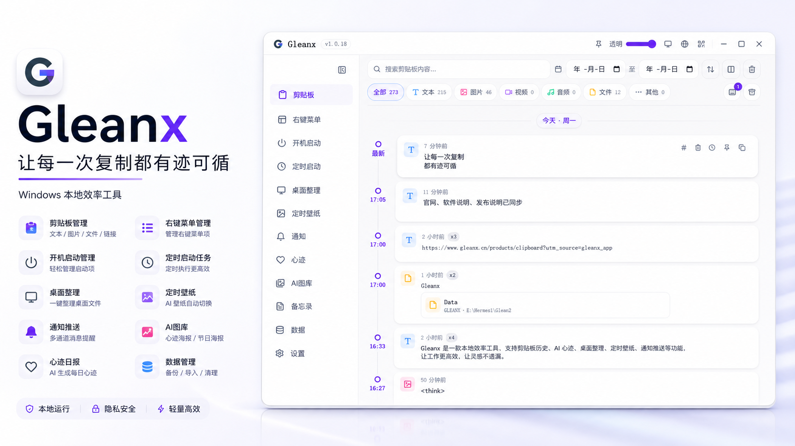
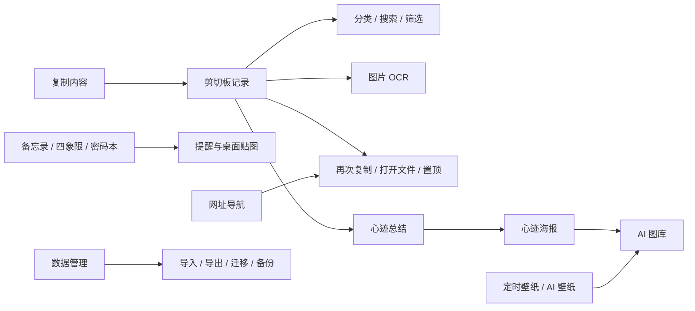

# Gleanx

> 把复制、整理、回看、提醒和生成集中在一个 Windows 客户端里。

开发者微信：Sugar_hyl，添加开发者反馈问题，提交想法，加入群聊。

  
   
  扫码添加开发者微信，反馈问题、提供想法、进入用户群。

  

  
  
  
  

Gleanx 是一款面向 Windows 用户的本地效率客户端。它不只是剪切板历史工具，而是把复制记录、图片 OCR、素材整理、心迹海报、备忘录、定时任务、网址导航、桌面整理和数据备份放到一个统一工作台里。

如果你经常遇到这些问题，Gleanx 可以补上这块能力：

- 复制过的文字、图片、文件和链接很快找不到。
- 截图里有重要文字，但后面无法检索和复用。
- 临时素材散落在聊天、浏览器、桌面和下载目录里。
- 每天做过什么、复制过什么、整理过什么没有沉淀。
- 需要一个轻量桌面工具，把备忘录、壁纸、网址、通知、定时任务和备份放在一起。

## 下载

最新 Windows 客户端请前往：

[Gleanx Releases](https://github.com/dcxa521gi/Gleanx/releases/latest)

## 产品预览

  

## 客户端核心功能

| 功能 | 能解决的问题 |
| --- | --- |
| 剪切板记录 | 自动记录文本、图片、音频、视频、代码、文件和目录，避免复制后找不到。 |
| 智能分类 | 按文本、图片、音频、视频、代码、文件等类型归类，减少手动整理。 |
| 图片 OCR | 对截图和图片内容进行文字识别，整理出更易读的标题和摘要。 |
| 重复内容合并 | 重复复制同一内容时不反复新增记录，而是前移已有记录并累计复制次数。 |
| 图片预览 | 图片预览窗口固定，缩放只作用于图片，支持居中查看和拖拽移动。 |
| 文件与目录复制 | 剪切板中的文件和目录支持再次复制，目录也可按系统文件列表复制。 |
| 附件打开 | 图片、视频、音频、代码和普通文件可直接打开原文件，原文件失效时使用缓存副本。 |
| 搜索与筛选 | 支持按关键词、类型、日期快速定位剪切板历史。 |
| 置顶与快捷复制 | 常用内容可置顶、设置快捷操作，减少重复查找。 |
| 心迹 | 根据每日使用轨迹生成 AI 总结，用于回看一天的工作与灵感。 |
| 心迹海报 | 支持不同回复风格、海报风格、长图查看、复制、下载和二维码拖拽放置。 |
| AI 图库 | 集中查看心迹海报、AI 壁纸和节日海报，方便复用生成结果。 |
| 定时壁纸 | 支持本地壁纸轮换、AI 壁纸生成、图生图和定时切换。 |
| 网址导航 | 保存常用网址、整理分类、记录点击和收藏，弥补浏览器收藏夹不够灵活的问题。 |
| 备忘录 | 支持备忘录、四象限、密码本、标签、定时提醒、锁定内容和桌面贴图。 |
| 软件通知 | 聚合软件公告、积分变化、审核结果、升级提醒等客户端通知。 |
| 数据管理 | 支持本地数据导出、导入、迁移、备份、恢复和清理。 |
| 开机启动 | 管理 Windows 和软件相关启动项，减少无效自启动。 |
| 定时任务 | 创建一次性、每日、每周和间隔任务；添加任务使用弹窗，不干扰列表浏览。 |
| 桌面整理 | 一键整理桌面文件，降低桌面文件堆积带来的查找成本。 |

## 1.3.3 更新重点

- 修复剪切板与备忘录桌面贴图关闭时连续出现错误的问题，贴图关闭和窗口通信更稳定。
- 修复代码文件、普通文件和目录再次复制时卡顿后失败的问题，继续保持 Windows 原生文件复制体验。
- 端到端同步默认关闭；个人中心提供带多次确认的账号注销与本机数据清理入口，数据边界更清晰。
- 修复“给 Ta 的信”确认发送后没有进入待发送列表的问题，积分使用与信件创建保持一致。
- 备忘录锁定内容改为本地加密保存，并保留可恢复、可迁移的使用路径。
- 为受邀账号预置插件市场体验，支持会员权益、积分兑换或支付购买；未开放时不会显示入口。

## 近期客户端优化

- 剪切板支持文本、图片、音频、视频、代码、文件和目录分类，重复内容自动合并。
- 图片预览窗口固定，缩放只作用于图片，支持居中查看和拖拽移动。
- 心迹海报支持风格切换、二维码添加和拖拽放置。
- 网址导航支持官方导航、个人导航、分类筛选、收藏、评论和书签导入。
- 备忘录支持备忘录、四象限、密码本、锁定内容和桌面贴图。
- 备忘录锁定内容使用本地加密保存，避免只依赖界面模糊隐藏。
- 数据管理支持导出、导入、迁移、备份、恢复和清理。

## 典型使用场景

### 1. 复制内容太多，事后找不到

Gleanx 会自动记录复制过的文本、图片、链接、文件和目录，并按时间线展示。你可以通过搜索、类型筛选、日期筛选快速找回内容。

### 2. 截图里有文字，但标题很乱

图片进入剪切板后，Gleanx 会尝试 OCR 识别并整理标题、摘要，让截图不只是一个图片文件，而是可以被搜索和回看的内容。

### 3. 每天工作很多，但没有沉淀

心迹功能会基于当天轨迹生成总结和海报，让复制、整理、浏览过的内容形成每日回顾。

### 4. 本地素材越来越散

AI 图库、定时壁纸、网址导航、备忘录和数据管理把常用数字资料集中在一个客户端里，减少跨工具查找。

### 5. 不想把隐私内容到处上传

Gleanx 优先以本地保存为中心。本地数据支持备份、迁移和恢复，适合希望把个人效率资料掌握在自己设备上的用户。

## 功能结构

## 适合谁使用

- 经常处理大量复制内容、截图、链接、文件和目录的 Windows 用户。
- 需要把工作素材、灵感和日常记录沉淀下来的人。
- 希望本地优先，不想把所有私人内容交给在线工具的人。
- 喜欢一个轻量桌面工作台，而不是在多个小工具之间来回切换的人。

## 作者与联系

- 作者：来日方长
- 开发者微信：`Sugar_hyl`

  
   
  扫码添加开发者微信，反馈问题、提供想法、进入用户群。

