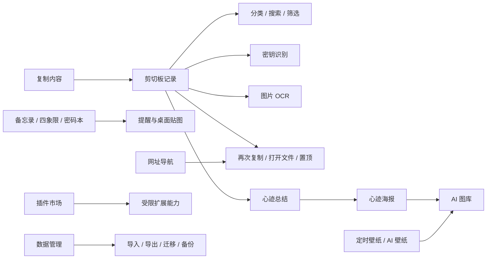

  
   
  扫码添加开发者微信，反馈问题、交流需求或进群。

# Gleanx

> 把复制、整理、回看、提醒、插件扩展和生成能力集中在一个 Windows 客户端里。

  

  
  
  
  

Gleanx 是一款面向 Windows 用户的本地效率客户端。它不只是剪切板历史工具，而是把复制记录、图片 OCR、素材整理、心迹海报、备忘录、定时任务、网址导航、桌面管理、插件市场和数据备份放到一个统一工作台里。

如果你经常遇到这些问题，Gleanx 可以补上这块能力：

- 复制过的文字、图片、文件、目录和链接很快找不到。
- 截图里有重要文字，但后面无法检索和复用。
- 临时素材散落在聊天、浏览器、桌面和下载目录里。
- 每天做过什么、复制过什么、整理过什么没有沉淀。
- 希望桌面工具能本地优先，同时按需接入 AI、壁纸、网址和插件能力。

## 下载

最新 Windows 客户端请前往：

[Gleanx Releases](https://github.com/dcxa521gi/Gleanx/releases/latest)

## 产品预览

以下图片和动态预览均为安全示意素材，不包含用户剪切板、桌面文件或私人内容。

  

| 剪切板时间线 | 图片 OCR 与素材整理 |
| --- | --- |
|  |  |

| 工作台聚合 | 心迹与备份 |
| --- | --- |
|  |  |

## 客户端核心功能

| 功能 | 能解决的问题 |
| --- | --- |
| 剪切板记录 | 自动记录文本、图片、音频、视频、代码、文件和目录，避免复制后找不到。 |
| 智能分类 | 按文本、图片、音频、视频、代码、文件、目录和密钥等类型归类，减少手动整理。 |
| 密钥识别 | 识别常见 API Key、GitHub、AWS、Google、Stripe、Slack、JWT 与私钥，避免敏感内容进入普通通知和心迹。 |
| 图片 OCR | 对截图和图片内容进行文字识别，整理出更易读的标题和摘要。 |
| 重复内容合并 | 重复复制同一内容时不反复新增记录，而是前移已有记录并累计复制次数。 |
| 图片查看器 | 图片、心迹海报和设置图片统一在应用内查看，缩放只作用于图片，支持居中和拖拽。 |
| 文件与目录复制 | 剪切板中的文件和目录支持再次复制，目录也可按系统文件列表复制。 |
| 附件打开 | 图片、视频、音频、代码和普通文件可直接打开原文件，原文件失效时使用缓存副本。 |
| 心迹 | 根据每日使用轨迹生成 AI 总结，并支持周、月、年自然周期自动生成。 |
| 心迹海报 | 支持不同回复风格、海报风格、长图查看、复制、下载和二维码拖拽放置。 |
| AI 图库 | 集中查看心迹海报、AI 壁纸和节日海报，使用渐进预览降低等待感。 |
| 定时壁纸 | 支持本地壁纸轮换、AI 壁纸生成、图生图、多参考图和定时切换。 |
| 网址导航 | 保存常用网址、整理分类、记录点击、收藏和评论，弥补浏览器收藏夹不够灵活的问题。 |
| 备忘录 | 支持备忘录、四象限、密码本、标签、定时提醒、锁定内容和桌面贴图。 |
| 桌面宠物 | 提供可互动的小拾桌宠，可悬停查看状态、聊天、喂食、洗澡、旅行、购物、抽签和查看运势。 |
| 设备控制中心 | 支持键盘、鼠标和 HID 设备检测，配置快捷键、应用级方案、宏步骤和安全暂停。 |
| 插件市场 | 支持已拥有插件优先展示、分类筛选、账号权益同步和受限声明式插件能力。 |
| 邀请好友 | 支持邀请码、邀请记录和软件通知同步，邀请码长度以当前配置为准。 |
| 个人中心 | 展示用户 ID、会员权益、等级经验、官方头像库、订单和端到端同步恢复码。 |
| 软件通知 | 聚合软件公告、积分变化、审核结果、升级提醒和邀请码变化等客户端通知。 |
| 系统优化 | 统一收纳右键菜单、开机启动、定时任务、桌面管理和定时壁纸。 |
| 数据管理 | 支持本地数据导出、导入、迁移、备份、恢复和清理。 |

## Gleanx 1.8.0 更新重点

本次 GitHub 公共版本汇总 1.6.2 之后到 1.8.0 的 Windows 客户端更新，只包含客户端功能与体验说明。

- 新增设备控制中心：可以查看键盘、鼠标和 HID 设备，配置按键映射、组合键、应用级方案和宏步骤。
- 设备控制加入安全暂停和积分确认：需要积分时会先弹窗确认，同一天不重复扣分；赞助权益用户可按权益直接使用。
- 新增桌面宠物“小拾”：支持桌面移动、悬停查看状态、右键打开互动、聊天、喂食、洗澡、旅行、购物、抽签和运势。
- 桌面宠物互动体验更稳定：修复出场、拖拽、悬停、右键、互动按钮和长文本气泡显示问题。
- 图片剪切板识别更强：优先使用随包本地 OCR 模型识别中英文，失败时自动回退，标题和摘要更容易阅读。
- 网址导航更清晰：官方聚合页按一级分类和二级分类展示，推荐网址会在推荐区和原分类中同时保留。
- 心迹生成更顺：赞助用户有剩余 AI 文本或海报额度时，优先使用对应权益，不再要求先配置本地 AI。
- 心迹海报和图片查看器继续优化：长图查看、缩放、拖拽、复制、下载和二维码放置更符合预览习惯。
- 插件市场继续完善：插件入口、购买反馈、已拥有插件展示、开发者申请和受限运行能力更清楚。
- 个人中心权益展示更直观：赞助等级、剩余次数、订单、礼包、邀请和恢复码等信息集中展示。
- 系统工具更稳：右键菜单、开机启动、桌面整理、定时任务、定时壁纸和设备控制归到统一的系统优化入口。
- 更新提醒更准确：只有服务器最新已发布版本高于当前客户端时才提示升级，避免旧版本误提醒。

## 典型使用场景

### 1. 复制内容太多，事后找不到

Gleanx 会自动记录复制过的文本、图片、链接、文件和目录，并按时间线展示。你可以通过搜索、类型筛选、日期筛选快速找回内容。

### 2. 截图里有文字，但标题很乱

图片进入剪切板后，Gleanx 会尝试 OCR 识别并整理标题、摘要，让截图不只是一个图片文件，而是可以被搜索和回看的内容。

### 3. 每天工作很多，但没有沉淀

心迹功能会基于当天轨迹生成总结和海报，让复制、整理、浏览过的内容形成每日回顾。

### 4. 想要扩展能力，但不想让插件乱执行

插件市场以账号权益、分类展示和受限能力清单为基础。插件可以扩展功能入口、复制、外链和壁纸切换等能力，但客户端不会执行插件包里的任意脚本。

### 5. 不想把隐私内容到处上传

Gleanx 优先以本地保存为中心。本地数据支持备份、迁移和恢复，适合希望把个人效率资料掌握在自己设备上的用户。

## 功能结构

## 适合谁使用

- 经常处理大量复制内容、截图、链接、文件和目录的 Windows 用户。
- 需要把工作素材、灵感和日常记录沉淀下来的人。
- 希望本地优先，不想把所有私人内容交给在线工具的人。
- 喜欢一个轻量桌面工作台，而不是在多个小工具之间来回切换的人。

## 作者与联系

- 作者：来日方长
- 开发者微信：`Sugar_hyl`

  
   
  扫码添加开发者微信，反馈问题、交流需求或进群。

