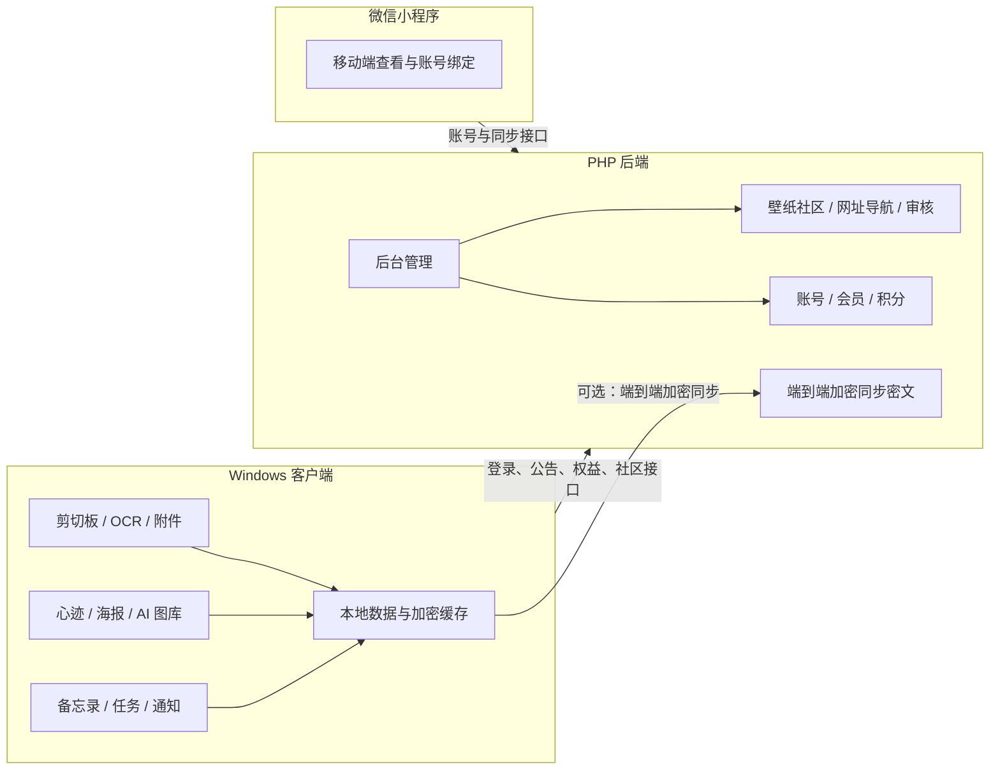

# Gleanx

> 让每一次复制都有迹可循，让每天的使用记录被整理、复用和回看。

<p align="center">
  
</p>

<p align="center">
  <a href="https://github.com/dcxa521gi/Gleanx/releases/latest"></a>
  
  
  
  
</p>

Gleanx 是一套以 Windows 客户端为核心的本地效率工具，围绕剪切板、备忘录、心迹、AI 图库、定时壁纸、网址导航、通知、账号权益和端到端同步，帮助用户把日常复制、整理、记录和回看变成可持续的个人知识流。

项目包含：

- Windows 桌面客户端：本地剪切板、AI 心迹、备忘录、壁纸、图库、通知和数据管理。
- PHP 后端：账号、会员、积分、勋章、公告、反馈、社区审核、网址导航、软件配置和后台管理。
- 微信小程序：移动端访问、账号绑定、云同步和轻量数据查看。

## 下载

最新 Windows 客户端请前往：

[Gleanx Releases](https://github.com/dcxa521gi/Gleanx/releases/latest)

自动更新文件随 Release 提供：

- `Gleanx-Setup-*.exe`
- `Gleanx-Setup-*.exe.blockmap`
- `latest.yml`

## 产品预览

<p align="center">
  
</p>

## 核心功能

| 模块 | 能力 |
| --- | --- |
| 剪切板 | 自动记录文本、图片、音频、视频、代码和文件；支持搜索、筛选、置顶、快捷复制、重复内容合并、OCR 标题整理和附件直接打开。 |
| 右键菜单 | 管理 Windows 右键菜单项，减少无效入口，保持系统菜单清爽。 |
| 开机启动 | 查看和管理 Windows 与 Gleanx 管理的启动项，支持启停和恢复。 |
| 定时任务 | 创建一次性、每日、每周和间隔任务，支持提醒和执行状态管理。 |
| 桌面整理 | 一键整理桌面文件，降低桌面文件堆积成本。 |
| 定时壁纸 | 本地壁纸轮换、AI 文生图、图生图、壁纸社区、分类、点赞、收藏和下载记录。 |
| 网址导航 | 私有网址本地保存，共享网址提交审核；支持分类、收藏、评论、点击统计和浏览器书签导入。 |
| 软件通知 | 聚合公告、积分变化、审核结果、升级提醒等软件通知。 |
| 心迹 | 基于每日使用轨迹生成 AI 日报和心迹海报，支持文字风格、海报风格、长图查看和本地隐私保存。 |
| AI 图库 | 集中查看 AI 壁纸、心迹海报和节日海报，支持放大、复制、下载和定位原图。 |
| 备忘录 | 备忘录、四象限、密码本、标签、定时提醒、锁定内容和桌面贴图。 |
| 数据管理 | 本地数据导入、导出、迁移、备份、清理和恢复。 |
| 账号中心 | 官方账号、观猹/微信第三方登录、会员、签到积分、用户等级、勋章、任务和积分商城。 |

## 系统结构



## 隐私与数据边界

Gleanx 优先保证本地数据可控：

- 剪切板、备忘录、心迹、海报等核心数据默认保存在本机。
- 心迹生成内容涉及隐私，客户端仅本地保存，不上传心迹正文、海报路径或生成内容到服务器。
- 云同步采用端到端加密设计，服务端保存的是同步密文和必要元数据。
- 后端安装包和增量包不应包含 `.env`、安装锁、运行数据和用户存储目录。

## 后台管理能力

后端后台用于配置和运营 Gleanx：

- 用户、会员、等级、积分、勋章、任务、兑换订单。
- 软件公告、软件信息、登录配置、AI 接口、邮箱、支付、小程序配置。
- 壁纸社区、网址导航、教程、客户端规则、客户端关于页。
- OSS 存储、审计日志、版本分布和运营概览。

## 技术栈

| 端 | 技术 |
| --- | --- |
| Windows 客户端 | Electron、React、TypeScript、Vite、Tailwind CSS、electron-builder |
| 本地能力 | Windows 剪切板、文件系统、系统通知、自动更新、Tesseract.js OCR |
| 后端 | PHP、MySQL、文件/OSS 存储、后台管理页 |
| 小程序 | uni-app、微信小程序、TypeScript |
| 同步与安全 | AES-256-GCM、scrypt、恢复码、可信设备、端到端加密同步 |

## 本地开发

安装依赖：

```bash
npm install
```

启动开发模式：

```bash
npm run dev
```

构建 Windows 客户端与后端完整包：

```bash
npm run build
```

生成后端增量包：

```bash
npm run build:server-update
```

生成微信小程序包：

```bash
npm run build:miniapp
```

执行核心验证：

```bash
npm test
```

## 交付物

常规发布会生成以下文件：

- Windows 安装包：`dist/Gleanx-Setup-<version>.exe`
- 自动更新 blockmap：`dist/Gleanx-Setup-<version>.exe.blockmap`
- 自动更新元数据：`dist/latest.yml`
- 后端完整包：`dist/Gleanx-Server-<version>.zip`
- 后端增量包：`dist/Gleanx-Server-Update-<version>.zip`
- 小程序包：`dist/Gleanx-MiniProgram-<version>.zip`
- SHA-256 清单：`dist/Gleanx-<version>-SHA256.txt`

## 部署说明

后端部署和升级请参考 `docs/` 目录中的版本升级说明。生产环境部署前请先备份：

- 数据库
- `.env`
- `storage`
- OSS / 对象存储
- 当前线上程序目录

增量包不得覆盖运行数据、密钥、安装锁或用户文件。

## 项目定位

Gleanx 不是单一剪切板工具，而是一个围绕“复制、整理、回看、同步、复用”的个人效率系统。

它适合需要长期整理素材、灵感、文件、链接、AI 生成结果和日常工作轨迹的 Windows 用户。

---

作者：来日方长
